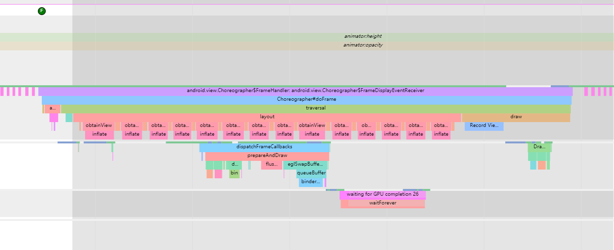
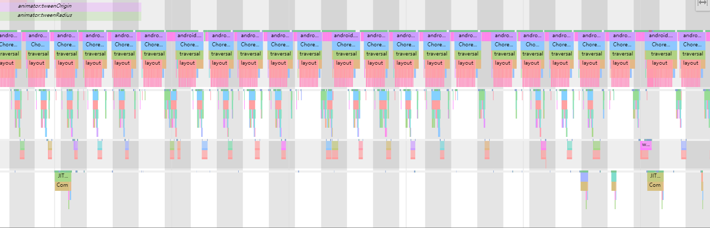

这个项目主要是一个 Demo ,用来对比 ListView 和 RecyclerView 的 Header 在做动画时候的性能表现

## ListView

ListView 的自定义 HeaderView  做动画的时候, 整个 ListView 都会触发 Layout ,导致每一帧的渲染性能大大下降

其中每一帧都如下

## RecyclerView

RecyclerView 的自定义 HeaderView 在做动画的时候, 整个 RecyclerView 不会触发 Layout 操作.

